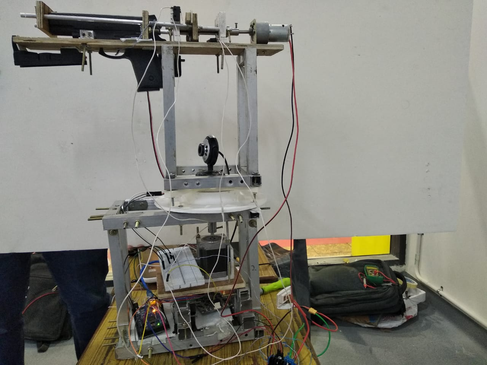
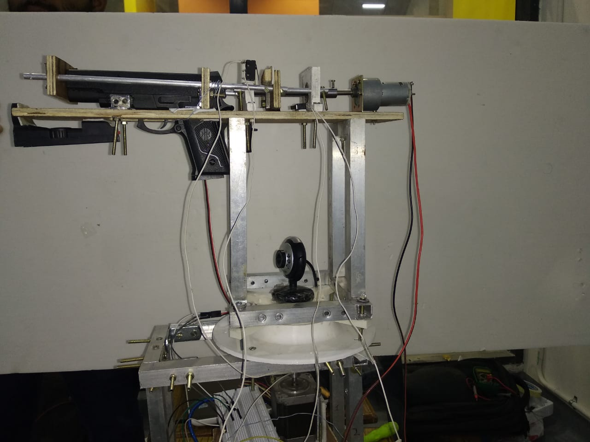

# MARS
## Aim Shooting Bot

### Images:

  
  
More Images and Videos in the Folder Img_Video itself.

### Abstract:
We made automatic "Shooting Bot" as a open project of MARS. It identifies the target, and the gun moves with the target once it aims at target. We have used deep learning for image proccessing and steppers for for precise and acccurate motion of the gun. The basic purpose of the bot is to avoid any human intrution in no man land. It can be considered as a prototype for our defence system and its actual version with heavy machine guns and snipers can be deployed at the disturbing international borders which are cause of casualties of our soldiers. Hence,we can attack enemy while protecting our soldiers. 

### Motivation:
Many iterations of this project can be seen in fictional stories/movies such as James Bond, etc. Considering it to be fairly simple, it was decided to showcase a model such as this in the Hobbies Club Exhibition. The initial brainstorming  showed us that this was a complicated project as independent motion of the gun and the accurate detection of the target in any background, couldn't be solved by simple mechanics and OpenCV respectively. This further motivated us to make this concept a reality.

### Mechanical Aspect:
The Mechanical Design comprises of two portions - The gun movement mechanism and the gun reloading mechanism.
The Gun Movement Mechanism - This further is divided into two parts - Lower and Upper part. The two portions are independent to rotate.
The Lower Part - This has a Stepper Motor and a Lazy Suzan Bearing, whose arrangement can be seen in the 3d model. This Part gives the gun a rotational freedom namely Yaw. We tried to use DC motor with encoder but to make that work was far more difficult and complicated. Issues we had were mainly the Encoder's inability to respond to small angles.
The Upper Part - This part is different than how we designed it to how we implemented it. The design was to provide the gun another rotational movement namely pitch. A proper implementation could not have been possible at that time so we proceeded with the gun just attached to the lower part with the help of an aluminium structure thus giving it necessary elevation.
The Gun Reloading Mechanism - This was accomplished by lead screw mechanism as that was the only mechanism which was powerful enough to reload the gun. This mechanism is completely designed according to the gun's dimension. A 900 RPM Johnson Geared Motor was used to make the process fast and reliable. Also to pull the trigger, a small servo motor was used.

### Electronic Aspect:
It uses tensorflow object-detection API to do the same.So it is easily possible to aim for 100 different classes as given in the API. It makes the model robust to changes as per the type of object which it should aim irrespective of the surrounding.

The electronic design uses arduino mega for controlling. One motor was used for the rotation and the other for the reload mechanism. For rotation Stepper was used with PID control. For reloading a 900rpm dc motor was used. Two motor drivers were used each for one motor.

Apart from that as all the image processing was done on Laptop a USB-TTL converter was used and attached to arduino for proper communication.

### Cost Structure:
The following project is a little costly to fabricate. In addition to the basic materials, Aluminium square channels and wood, the cost of Stepper Motor and DC Motor were significant. Other expenses include - Toy Gun, Servo Motor and occasional 3D prints. While on the Electronics side, Motor Drivers and Arduino add to the cost. Most of the motors, boards used were available in the section, which helped to build the project in a relatively cheap amount.

### Applications:
It can be deployed at larger scales for border security that is to say in defense applications. As the model is robust to surroundings and can detect any out of 100 different classes it makes it better for use in Defense applications.

### Limitations:
The only limitation is that it has no optical locking mechanism that is to say that it doesnt work properly if it has more than one object of interest in its frame. 

### Future Improvements:
Better tuning of the PID.
Using Optical Flow for target locking.
Better mechanical design to make it more appealing.

### Team Members:
Abhishek Agarwal
Aditya Kanfade
Aditya Raj
Jatin Varshney

### Mentors:
Prashant

### References:
Tensorflow object Detection-API.  
https://www.youtube.com/playlist?list=PLQVvvaa0QuDcNK5GeCQnxYnSSaar2tpku

Sample model for mechanical structure.  
https://www.youtube.com/watch?v=HoRPWUl_sF8
